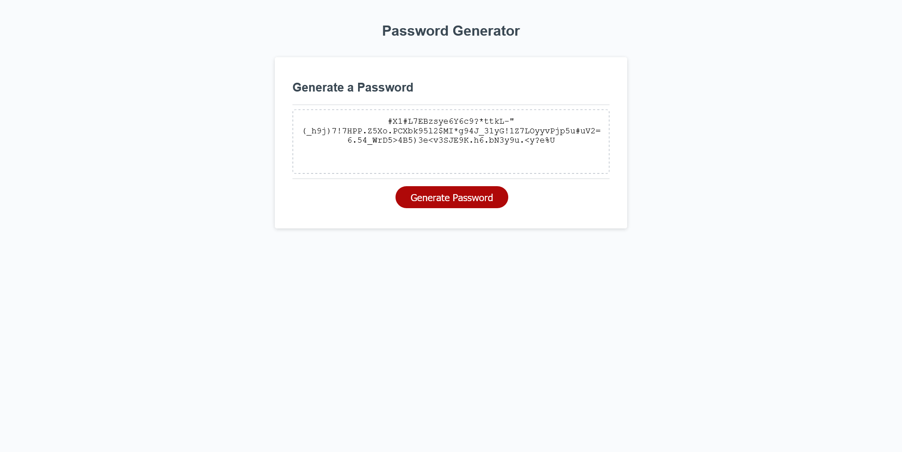

# 03-password-gen

## Description

I was tasked with creating a password generator which would allow the user to select a length between 8 and 128 characters, and then generate a password using up to four character types (lower case, upper case, numbers, and special characters) should they so choose. It was an interesting problem to solve as there were a number of corner cases to account for. For example, if the user did not enter any number into the length prompt, or did not choose a single character type to make their password out of, my program had to continually prompt them for that information until they finally entered it. 

In building this, I also wanted to ensure that every type of character the user selected would show up in the generated password, so I had my program iterate through each character type selected one at a time, pushing each character type into the final password array before cutting it down to size. However because of this method, the passwords would always be written in a predictable order of lower, upper, number, special. To counter this I wrote a sort code that shuffled the password before finally printing it on the screen.

Instead of having to write out strings or arrays of every possible character within the character sets, I decided to utilize the unicode decimal values of the characters, choosing a random number from the appropriate range, and then converting it into its corresponding value. This method worked great until I got to the special characters, which were unfortunately split across four different number ranges. I could not figure out how to randomly select one number from four different number ranges, so instead I decided to write out a string with every character.

## Links

- [Deployed Webpage](https://en-moss.github.io/03-password-gen/ "Deployed Webpage")

## Screenshot

